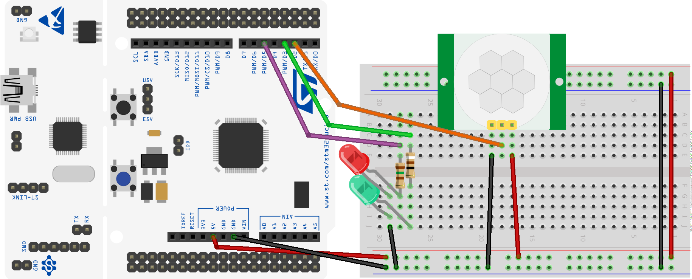
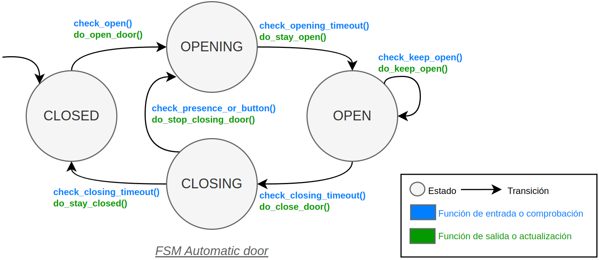

# Automatic door system

This project implements an alarm system with a PIR, a button and 2 LEDs. The system uses an FSM to manage the different states of the system and hardware. The HW configuration is shown in the following picture:

The system uses an FSM to manage the different states of the system and hardware. This picture shows the FSM of the system:

You can generate as many sensor detectors as you want by creating a new FSM and assigning the corresponding peripherals to the system. The system which is implemented in the `main.c` file. The system uses the following peripherals:

## Implementación HW

### PIR sensor

The PIR sensor is connected to the pin `PA10`. The sensor is configured as an input with no push-pull resistor. The sensor generates an interrupt when it detects movement. The interrupt is configured with the following settings:

| Parameter     | Value                    |
| ------------- | ------------------------ |
| Variable name | pir_sensor_home_alarm    |
| Pin           | PA10 (D2 on Nucleo)      |
| Mode          | Input                    |
| Pull up/ down | No push no pull          |
| Edge          | Both: Rising and Falling |
| EXTI          | EXTI10                   |
| ISR           | EXTI15_10_IRQHandler()   |
| Priority      | 1                        |
| Subpriority   | 0                        |

### Button

The button is connected to the pin `PC13`. The button is configured as an input with no push-pull resistor. The button generates an interrupt when it is both pressed and released. The interrupt is configured with the following settings:

| Parameter     | Value                    |
| ------------- | ------------------------ |
| Variable name | button_home_alarm        |
| Pin           | PC13 (B1 on Nucleo)      |
| Mode          | Input                    |
| Pull up/ down | No push no pull          |
| Edge          | Both: Rising and Falling |
| EXTI          | EXTI13                   |
| ISR           | EXTI15_10_IRQHandler()   |
| Priority      | 3                        |
| Subpriority   | 0                        |

### LEDs

There are 2 LEDs to indicate the state of the system. A **green LED** (`led_opening`) is used to indicate that the automatic door is opening (blinking) or open (on). A **red LED** (`led_closing`) is used to indicate that the automatic door is closing (blinking) or closed (on).  The LEDs are configured with the following settings:

Both LEDs blink with a different interrupt interval. Each one is controlled by a different timer to generate interrupts.

| Parameter     | Value              |
| ------------- | ------------------ |
| Variable name | led_opening        |
| Pin           | PB3 (D3 on Nucleo) |
| Mode          | Output             |
| Pull up/ down | No push no pull    |
| Timer         | TIM3               |
| Interrupt     | TIM3_IRQHandler()  |
| Time interval | 500 ms             |
| Priority      | 2                  |
| Subpriority   | 0                  |

| Parameter     | Value              |
| ------------- | ------------------ |
| Variable name | led_closing        |
| Pin           | PB4 (D5 on Nucleo) |
| Mode          | Output             |
| Pull up/ down | No push no pull    |
| Timer         | TIM4               |
| Interrupt     | TIM4_IRQHandler()  |
| Time interval | 100 ms             |
| Priority      | 2                  |
| Subpriority   | 0                  |

### Motor

Aun no se ha implementado el motor físicamente, se ha dejado lo suficientemente preparado para cuando se implemente. Al menos están las funciones que controlan el tiempo que está **abriéndose y cerrándose**, así como el **tiempo que está abierta** la puerta. Durante ese tiempo parpadean los LEDs correspondientes. Ese tiempo se gestiona con un temporizador que se activa cuando se abre la puerta y se desactiva cuando se cierra.

| Parameter     | Value                                              |
| ------------- | -------------------------------------------------- |
| Variable name | motor_timer                                        |
| Timer         | TIM2                                               |
| Interrupt     | TIM2_IRQHandler()                                  |
| Time interval | Diferente para abrir/ cerrar, y para estar abierta |
| Priority      | 2                                                  |
| Subpriority   | 0                                                  |

## Funcionamiento detallado del sistema

El sistema está codificado según el diagrama de estados mostrado anteriormente. El sistema se comporta de la siguiente manera:

* La puerta arranca cerrada (`CLOSED`) con el **LED rojo encendido**.
* Si se detecta una presencia (sensor PIR), o se pulsa el botón, la puerta empezará a abrirse (`do_open_door()`). `do_open_door()`:
  * Apaga el LED rojo (`led_closing`).
  * Activa el temporizador del LED verde (`led_opening`) para que parpadee.
  * Arranca el temporizador del motor para controlar el **tiempo que la puerta está abriéndose**.
  * Activa el *flag* `presence_or_button_status` de la FSM.
  * Por último, guarda el instante de tiempo en el que se ha detectado la presencia o se ha pulsado el botón en la variable `last_time_presence_or_button` de la FSM.
* Cuando la puerta se está abriendo (`OPENING`) el LED verde parpadea durante `AUTOMATIC_DOOR_OPENING_CLOSING_TIMEOUT_MS` milisegundos, que es el tiempo que está el motor funcionando. Cuando haya pasado ese tiempo, saltará la ISR `TIM2_IRQHandler()`. Esta ISR:
  * Activa el *flag* `timeout` del motor llamando a la función `port_motor_set_timeout_status()`. Este flag indica que la puerta se ha abierto por completo, y lo leerá la FSM.
  * Limpia el *flag* de interrupción del temporizador en el registro `SR`.
* La FSM comprueba con la función `check_opening_timeout()` que el *flag* `timeout` del motor está activo. Si es así, la FSM pasa al estado `OPEN` y llama a la función `do_stay_open()`.
  * La función `do_stay_open()`:
    * Deja el LED verde (`led_opening`) fijo.
    * Desactiva el temporizador del parpadeo del LED verde.
    * Activa el temporizador del motor para controlar el **tiempo que la puerta está abierta**. Este tiempo es de `AUTOMATIC_DOOR_INACTIVITY_TIMEOUT_MS` milisegundos.
* Mientras la puerta está abierta (`OPEN`), pasarán `AUTOMATIC_DOOR_INACTIVITY_TIMEOUT_MS` milisegundos para cerrarse. Pasados dicho tiempo, vuelve a saltar la ISR `TIM2_IRQHandler()`. La ISR realiza las mismas acciones antes mencionadas.
* En el estado `OPEN`, la FSM comprobará con la función `check_closing_timeout()` que el *flag* `timeout` del motor está activo. Si es así, la FSM pasa al estado `CLOSING` y llama a la función `do_close_door()`.
  * La función `do_close_door()`:
    * Apaga el LED verde (`led_opening`).
    * Activa el temporizador del LED rojo (`led_closing`) para que parpadee.
    * Arranca el temporizador del motor para controlar el **tiempo que la puerta está cerrándose** (`AUTOMATIC_DOOR_OPENING_CLOSING_TIMEOUT_MS` milisegundos).
    * Por último, desactiva el *flag* `presence_or_button_status` de la FSM.
* También en el estado `OPEN`, si se detecta una presencia (sensor PIR), o se pulsa el botón, deberá abrir la puerta (función `check_keep_open()`), la FSM se mantiene en el estado `OPEN` y llama a la función `do_keep_open()`.
  * La función `do_keep_open()`:
    * Re-activa el temporizador del motor, de nuevo, para controlar el tiempo que la puerta está abierta sea de nuevo `AUTOMATIC_DOOR_INACTIVITY_TIMEOUT_MS` milisegundos.
* En el estado `CLOSING`, el LED rojo está parpadeando y la FSM comprueba con la función `check_closing_timeout()` si el *flag* `timeout` se ha activado, *i.e.*, ha pasado el tiempo de cerrarse. Si es así, la FSM pasa al estado `CLOSED` y llama a la función `do_stay_closed()`.
  * La función `do_stay_closed()`:
    * Deja el LED rojo (`led_closing`) fijo.
    * Desactiva el temporizador del parpadeo del LED rojo.
    * Desactiva el temporizador del motor.
* También en el estado `CLOSING`, si se detecta una presencia (sensor PIR), o se pulsa el botón, deberá abrir la puerta (función `check_presence_or_button()`), la FSM pasa al estado `OPENING` y llama a la función `do_stop_closing_door()`.
  * La función `do_stop_closing_door()`:
    * Deja el LED rojo (`led_closing`) fijo.
    * Desactiva el temporizador del parpadeo del LED rojo.
    * Llama a la función `do_open_door()` que realiza las mismas acciones que cuando se abre la puerta.
    >[!NOTE]
    > La implementación actual no contempla el tiempo que llevaba la puerta cerrándose, y el motor volverá a abrirse estando activo todo el tiempo que se haya configurado para la apertura. Una versión mejorada debería tener en cuenta el tiempo que llevaba cerrándose y abrirse durante el mismo tiempo.

Vaya al ejercicio [Ejercicio](ejercicio.md) para realizar los cambios necesarios para que funcione correctamente.

## References

- **[1]**: [Documentation available in the Moodle of the course](https://moodle.upm.es/titulaciones/oficiales/course/view.php?id=785#section-0)
- **[2]**: [Embedded Systems with ARM Cortex-M Microcontrollers in Assembly Language and C (Fourth Edition)](https://web.eece.maine.edu/~zhu/book/index.php) for explanations and examples of use of the ARM Cortex-M microcontrollers in C with CMSIS.
- **[3]**: [Programming with STM32: Getting Started with the Nucleo Board and C/C++](https://ingenio.upm.es/primo-explore/fulldisplay?docid=34UPM_ALMA51126621660004212&context=L&vid=34UPM_VU1&lang=es_ES&search_scope=TAB1_SCOPE1&adaptor=Local%20Search%20Engine&tab=tab1&query=any,contains,Programming%20with%20STM32:%20Getting%20Started%20with%20the%20Nucleo%20Board%20and%20C%2FC%2B%2B&offset=0) for examples of use of the STM32 microcontrollers with the HAL of ST.
- **[4]**: [The C Programming Language](https://ingenio.upm.es/primo-explore/fulldisplay?docid=34UPM_ALMA2151866130004212&context=L&vid=34UPM_VU1&lang=es_ES&search_scope=TAB1_SCOPE1&adaptor=Local%20Search%20Engine&isFrbr=true&tab=tab1&query=any,contains,C%20Programming%20Language)
- **[5]**: [Nucleo Boards Programming with th STM32CubeIDE](https://www.elektor.com/products/nucleo-boards-programming-with-the-stm32cubeide) for examples of use of the STM32 microcontrollers with the STM32CubeIDE.
