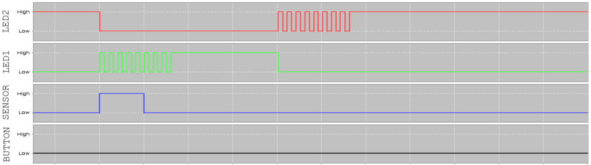

# Ejercicio

**En este ejercicio se trata de emular el comportamiento del sistema de una puerta automática de un centro comercial. Este sistema controla: sensor de presencia, botón de emergencia y 2 LEDs de indicación de funcionamiento (en este ejercicio no controlamos el motor).**

## Preguntas

**1. El programa no compila por diversos motivos. Se le pide que complete el código para hacerlo funcionar. En concreto:**

* Ajuste los `#define`:
  * `AUTOMATIC_DOOR_OPENING_CLOSING_TIMEOUT_MS` para que la puerta se esté abriendo o cerrando 5 segundos.
  * `AUTOMATIC_DOOR_INACTIVITY_TIMEOUT_MS` para que la puerta se cierre automáticamente si no hay actividad en 10 segundos.
  * Ponga todos los valores de configuración de los LEDs según se indica en las tablas del [enunciado](index.html).
* Implemente la tabla de transiciones de la FSM `fsm_trans_automatic_door` en  `fsm_automatic_door.c` según el diagrama de estados de la [figura](index.html).

    >[!IMPORTANT]
    > Recuerde que debe haber 1 línea por cada arco del diagrama y que debe acabar con `{-1, NULL, -1, NULL }`.

* Complete la función `fsm_automatic_door_init()` en `fsm_automatic_door.c` como indica la API.
* En el `main()` crea la máquina de estados y la inicializa llamando a la función `fsm_automatic_door_new()`.
  
    > [!TIP]
    > Los parámetros de la función `fsm_automatic_door_new()` son las direcciones de memoria del sensor de presencia, el botón de emergencia y los LEDs de indicación de funcionamiento. Estos se encuentran definidos en su *port* correspondiente.

**2. Compruebe que el código funciona correctamente y súbalo a Moodle.**

En particular, compruebe que funciona en las siguientes situaciones:

* **Situación 1:**

    La puerta está cerrada y se activa el sensor de presencia momentaneamente. El LED rojo se apaga, el LED verde parpadea, y la puerta se abre. Pasados `AUTOMATIC_DOOR_OPENING_CLOSING_TIMEOUT_MS` milisegundos, el LED verde se queda fijo durante `AUTOMATIC_DOOR_INACTIVITY_TIMEOUT_MS` milisegundos y la puerta se cierra. En este momento, el LED verde se apaga, el LED rojo parpadeará y la puerta se cerrará quedando el LED rojo fijo. La situación se muestra en la siguiente figura:

    

* **Situación 2:**

    Como en la situación anterior, pero ahora, cuando el LED verde se queda fijo y antes de que se cierre la puerta, se pulsa el botón de emergencia. En este momento, el contador del motor se reinicia y sigue fijo el LED verde por más tiempo. Pasado el tiempo correspondiente, el LED rojo parpadea y la puerta se cierra quedando el LED rojo fijo. La situación se muestra en la siguiente figura:

    
  
* **Situación 3:**

    Como en la situación 1, pero ahora, cuando el LED rojo está parpadeando (*i.e.*, la puerta se está cerrando), se activa el sensor de presencia. En este momento, el contador del motor se reinicia y se abre la puerta. Se apaga el LED rojo, y parpadea el LED verde. Pasados `AUTOMATIC_DOOR_OPENING_CLOSING_TIMEOUT_MS` milisegundos, el LED verde se queda fijo durante `AUTOMATIC_DOOR_INACTIVITY_TIMEOUT_MS` milisegundos y la puerta empezará a cerrarse nuevamente, volviendo a parpadear el LED rojo. La situación se muestra en la siguiente figura:

    
